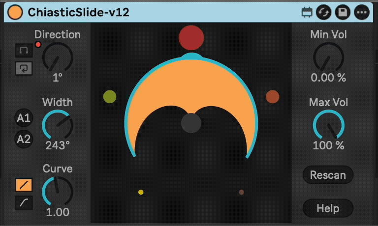
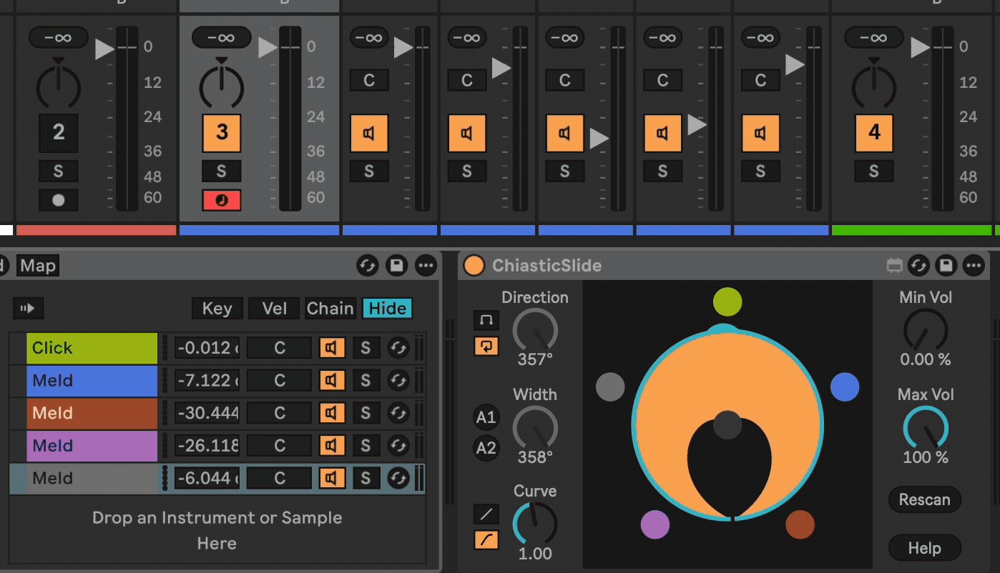

# Chiastic Slide

Chiastic Slide is a Max for Live device that acts as a crossfader to a multi-chain device such as a Group Track, Instrument Rack, Drum Rack, or Audio Effect Rack. It can handle up to 32 chains, with control over the crossfade width.

Chains or child tracks are shown as colored balls on the perimeter of a circle. You can control a virtual mic with the Direction control. The "pickup pattern" of the mic can be controlled with the Width and Curve controls.

This allows you to have multiple chains of parallel material, instruments, or effects and fade between them while time marches forward.

I created this plugin when I saw that the Abelton's Rack devices (Instrument Rack, Audio Effect Rack) `Chain Selector` parameter only controlled input rather than output. I was looking to have any number of sounds playing simultaneously, but be able to smoothly fade between them without disrupting time.

Traditionally, you can use this to fade between several different tracks, instruments, or effects chains. Load up a few different pads in an Instrument Rack and give it a try by adding Chiastic Slide right after the rack.

If you're interested in this, then you may also be interested in my other device called [SimulScrub](https://plugins.steinkamp.us/m4l-SimulScrub).

## Installation

Download the latest release from this page and drag the device file to your User Library in Ableton Live.

## Changelog

- 2025-10-30 [v12](https://github.com/zsteinkamp/m4l-ChiasticSlide/releases/download/v12/ChiasticSlide-v12.amxd) - Fix bug related to rendering audio. Thanks Dino Spiluttini for the report! Also watches for path changes to respond to being moved around the chain. Animates the size of the balls depending on volume.
- 2025-09-25 [v11](https://github.com/zsteinkamp/m4l-ChiasticSlide/releases/download/v11/ChiasticSlide-v11.amxd) - Improved help popup and refreshed images in documentation.
- 2024-12-15 [v10](https://github.com/zsteinkamp/m4l-ChiasticSlide/releases/download/v10/ChiasticSlide-v10.amxd) - Adds two "Auto" buttons to set up the device to fade between the number of sources with even volume, regardless of direction setting. A1 only works well when there are > 3 chains. Again, thanks @Luke-KB for the idea.
- 2024-12-11 [v9](https://github.com/zsteinkamp/m4l-ChiasticSlide/releases/download/v9/ChiasticSlide-v9.amxd) - Adds an automation-aware toggle for the endless direction knob. Thanks again @Luke-KB for the feedback! Also makes the visualization more accurate when min/max vol is used.
- 2024-12-07 [v8](https://github.com/zsteinkamp/m4l-ChiasticSlide/releases/download/v8/ChiasticSlide-v8.amxd) - Fixes a bug when the endless direction knob is automated to 0 or 360 disabling automation.
- 2024-11-29 [v7](https://github.com/zsteinkamp/m4l-ChiasticSlide/releases/download/v7/ChiasticSlide-v7.amxd) - Accurately show pickup pattern. Math is fun! Direction knob is _endless_. Feedback welcome on if this is problematic. For me it is 10x the fun.
- 2024-10-29 [v6](https://github.com/zsteinkamp/m4l-ChiasticSlide/releases/download/v6/ChiasticSlide-v6.amxd) - Add non-blocking telemetry ping on load. Does not send any identifying information, only the plugin name, the local computer name, type of computer, and CPU type. I just want to see which plugins are used the most.
- 2024-09-13 [v5](https://github.com/zsteinkamp/m4l-ChiasticSlide/releases/download/v5/ChiasticSlide-v5.amxd) - Track changes in track/chain colors and children adding/removing/reordering.
- 2024-09-10 [v4](https://github.com/zsteinkamp/m4l-ChiasticSlide/releases/download/v4/ChiasticSlide.v4.amxd) - Re-imagine UI as a circle, add a Curve control.
- 2024-04-27 [v3](https://github.com/zsteinkamp/m4l-ChiasticSlide/releases/download/v3/ChiasticSlide.v3.amxd) - Support group tracks. Provide a visual for volumes.
- 2024-01-15 [v2](https://github.com/zsteinkamp/m4l-ChiasticSlide/releases/download/v2/ChiasticSlide.v2.amxd) - Pretty big rework to fix an undo buffer flood bug.
- 2024-01-09 v1 - Initial Release (download disabled).

## Usage

Add this device to a Group Track or immediately after an Instrument Rack or Audio Effect Rack device.

`Direction` - Controls where the virtual microphone is pointed.

`Limit / Endless` - Controls whether the Direction dial stops at its limits or behaves as an endless dial. Endless is fun!

`Width` - Adjust how many adjacent sources are audible, i.e. the "pickup pattern" of the mic.

`A1` / `A2` - Two different auto settings for even-power crossfading.

`Curve` - Adjusts the falloff of the pickup pattern. Low values raise the volume of adjacent sources.

`Linear` / `Cosine` - Controls the impact of the Curve parameter on the actual output.

`Min Vol` - The minimum volume level.

`Max Vol` - Maximum volume level.

`Rescan` - Click this if you add, remove, or change the color of  tracks/chains.

## TODO
- ...

## Developing

I personally develop inside of a VSCode DevContainer. My workflow is to run `devcontainer open .`. This will build a container to run the Typescript/Node toolchain in and open VSCode in that container. It removes the need to maintain a node.js or other software toolchain on your computer.
